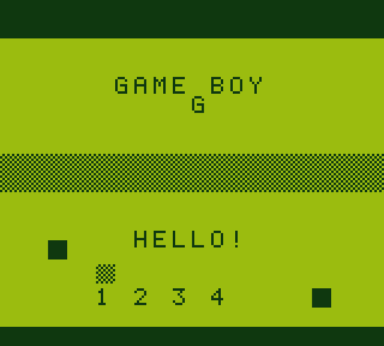

# gbemu

A Game Boy emulator written in C, built as a weekend project to learn how
computers and memory actually work. It runs on Linux (and anything else with
SDL2 and a C compiler), renders with the classic green DMG palette, and has
sound.



## What works

- Full CPU instruction set (all opcodes plus the `0xCB` prefix table)
- Cartridge types: ROM only, MBC1, MBC2, MBC3 (with RTC) and MBC5
- Background, window and sprite rendering with the 4-shade green palette
- Timers (DIV + TIMA), interrupts, and the joypad
- All four sound channels (two squares, wave, noise) through SDL
- `.sav` files for battery-backed games
- Keyboard input, saveable screenshots (F12)

The CPU passes the full [Blargg cpu_instrs](https://github.com/retrio/gb-test-roms)
test suite (all 11 tests).

## Building

You need a C compiler, `make`, and SDL2. On Kali / Debian:

```sh
sudo apt update
sudo apt install build-essential libsdl2-dev
```

Then:

```sh
make
```

That produces a single `gbemu` binary.

## Running

```sh
./gbemu roms/test.gb          # bundled demo ROM
./gbemu path/to/tetris.gb     # your own ROM
```

Options:

```
--scale N          window scale factor (default 4)
--mute             disable audio
--frames N         exit after N frames
--screenshot FILE  save a screenshot and exit
```

### Controls

| Key        | Action  |
|------------|---------|
| Arrows     | D-pad   |
| Z          | B       |
| X          | A       |
| Enter      | Start   |
| Backspace  | Select  |
| F12        | Screenshot (saves `gbemu.bmp`) |
| Esc        | Quit    |

## How to test it

There is a small homebrew ROM included at `roms/test.gb`. It was generated by
`tools/gen_test_rom.py` and draws a test card (title text, a checkerboard
strip and a few sprites) to prove tiles, tile maps and sprites all render:

```sh
make run
```

For something more rigorous, run the Blargg CPU tests. They print `Passed` or
`Failed` over the serial port, which the emulator forwards to stdout:

```sh
git clone https://github.com/retrio/gb-test-roms
for rom in gb-test-roms/cpu_instrs/individual/*.gb; do
    echo "== $rom =="
    ./gbemu "$rom" --frames 2400 --mute | grep -Ei "passed|failed"
done
```

All 11 should report `Passed`.

You can also grab `dmg-acid2.gb` (build it from
[mattcurrie/dmg-acid2](https://github.com/mattcurrie/dmg-acid2)) to eyeball the
GPU output.

## Project layout

```
src/
  main.c      SDL2 front end, main loop, CLI
  cpu.c       the CPU interpreter (all opcodes + CB prefix)
  mmu.c       memory bus and I/O register routing
  gpu.c       LCD state machine and scanline renderer
  apu.c       audio processing unit
  timer.c     DIV / TIMA timers
  joypad.c    P1 register and joypad interrupt
  cart.c      cartridge loading and MBC logic
  gb.h        central struct + public API
tools/
  gen_test_rom.py   builds roms/test.gb from scratch
roms/
  test.gb           bundled homebrew demo ROM
screenshots/
  gbemu.png         screenshot of the demo ROM
```

## How it works

The machine is one struct (`gb_t` in `src/gb.h`) holding the CPU, MMU, GPU,
APU, timers, joypad and cartridge state. The main loop runs exactly 70224
T-cycles (one frame) per iteration:

1. `cpu_step` executes one instruction and returns its cycle count
2. timers, GPU and APU are each advanced by that many cycles
3. when the GPU wraps around to scanline 0, `frame_ready` is set
4. the framebuffer is pushed to SDL and the frame is throttled to ~60 fps

### Memory map

```
0000-3FFF  ROM bank 0 (fixed)
4000-7FFF  ROM bank N (switchable)
8000-9FFF  Video RAM
A000-BFFF  Cartridge RAM
C000-DFFF  Work RAM (E000-FDFF is an echo)
FE00-FE9F  Sprite attribute table (OAM)
FF00-FF7F  I/O registers
FF80-FFFE  High RAM
FFFF       Interrupt enable
```

### CPU

Registers are stored with anonymous structs/unions so you can read `a`, `f`,
or the pair `af` directly, the same trick the original Cinoop write-up
suggests. Flag bits live in `f`: Z=0x80, N=0x40, H=0x20, C=0x10.

Two instructions are worth a note because they trip people up:

- **DAA** always clears the half-carry flag.
- **CCF** clears the half-carry flag (this is the SM83, not a Z80).

### GPU

The LCD draws one scanline at a time. Mode timing is 80 cycles of OAM scan,
172 of VRAM transfer and 204 of HBlank per line, with 10 lines of VBlank.
The background, window and up to 10 sprites per line are composited into a
160x144 ARGB framebuffer.

### Audio

Each channel clocks itself against a 44.1 kHz sample counter, and samples are
queued to SDL once per frame. It is not cycle-accurate, but it makes the
right noises for most games.

## Known limitations

- No Game Boy Color, no SGB, no link cable
- No cycle-accurate timing (fine for CPU tests, not for the Blargg *timing*
  tests or emulator-lag tricks)
- Audio is functional but not bit-accurate
- MBC7, HuC-1 and the infrared/Buzzer cartridge features are not implemented

## Thanks

Based on ideas from CTurt's
[Writing a Game Boy emulator, Cinoop](https://cturt.github.io/cinoop.html),
which is what the original assignment points at. Useful references while
writing this: [gbdev.io](https://gbdev.io/pandocs/),
[Pan Docs](https://gbdev.io/pandocs/), and the Blargg test ROMs.

## License

MIT, see [LICENSE](LICENSE).
